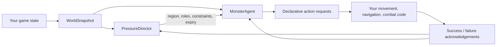

# Two-Brain Director for s&box

s&box package identity: `local.two_brain_director` (unpublished)

A generalized, deterministic two-layer monster AI library inspired by the two-brains architecture of Alien: Isolation. It does not contain Creative Assembly code or assets. Its clean-room core consumes plain snapshots and emits declarative decisions, leaving entities, navigation, animation, combat, and game rules to your game.

Repository: https://github.com/zeljkovranjes/sbox-two-brain-director

Documentation: [architecture](docs/ARCHITECTURE.md) · [API map](docs/API.md) · [tick order](docs/TICK_ORDER.md) · [configuration](docs/CONFIG_REFERENCE.md) · [evidence map](docs/EVIDENCE_MATRIX.md)

Current release: **unreleased**. See the [changelog](CHANGELOG.md).

## How it fits

The macro layer (`PressureDirector`) decides when and where tension should build: pressure
gauges, normal/aggressive modes, opportunity quotas, cooldowns, spatial exclusion, offstage
sweeps and ingress suggestions. The micro layer (`MonsterAgent`) decides what the creature
can actually do from local perception and navigation state: investigate, search, stalk,
threaten, chase, attack, retreat, and offstage traversal. The macro never hands the micro
perfect target coordinates, and neither layer ever moves an entity directly.

## Determinism

Identical configuration, seed, ticks, snapshots, and host acknowledgements produce
byte-identical decisions. Time is explicit and monotonic, all randomness flows through a
seedable RNG whose complete state serializes into every save, and floating point is kept to
`+ − * /` and square root in double precision.

## Evidence discipline

Research-derived constants live only in the optional `AlienIsolationInspired` compatibility
preset. Proven facts may shape that preset; inferred behavior stays configurable; clean-room
proposals are architecture, not recovered source. See [docs/EVIDENCE_MATRIX.md](docs/EVIDENCE_MATRIX.md).
