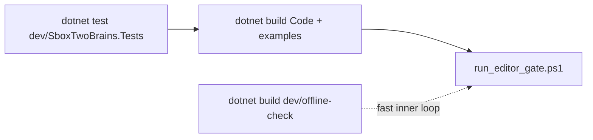

# Editor compile gate

The authoritative s&box compile check for the library. The core passes `dotnet`
unit tests, but the s&box editor compiles package code with its own compiler and its
own whitelist (SB500) — this rig proves the library compiles inside a real editor
session. Adapted from humanoid-retargeter's verified rig.

## What it does

1. Creates a scratch s&box game project at `%TEMP%\tb-editor-rig\scratch` from the
   `templates\game.minimal` template (created once, reused afterwards).
2. Installs the library into it as `Libraries\local.two_brain_director` — an NTFS
   **junction** to the repository root by default, or a robocopy mirror with
   `-CopyLibrary`. The scratch project deliberately lives outside the repo: a
   scratch inside the library tree would create a junction cycle
   (lib → repo → scratch → lib) that intermittently crashes the editor.
3. Writes a one-shot arming marker (`gate_result.json.arm`), sets `TB_GATE_RESULT`,
   and launches `sbox-dev.exe -project <scratch>`.
4. Inside the editor, `Editor/CompileGate.cs` (an `[EditorEvent.Frame]` hook) waits
   for the project and asset system, verifies the open project **is** the
   tb-editor-rig scratch, confirms the `two_brain_director` package assembly
   compiled and the `TwoBrainsSystem` core type is loadable, scans `sbox-dev.log`
   for compile errors and SB500 whitelist violations mentioning the library, writes
   `gate_result.json` next to the script, and quits the editor.
5. The driver reports pass/fail from the JSON and prints the run's filtered log.

## Usage

```powershell
powershell -ExecutionPolicy Bypass -File dev\editor-rig\run_editor_gate.ps1
powershell -ExecutionPolicy Bypass -File dev\editor-rig\run_editor_gate.ps1 -Clean
powershell -ExecutionPolicy Bypass -File dev\editor-rig\run_editor_gate.ps1 -CopyLibrary
powershell -ExecutionPolicy Bypass -File dev\editor-rig\run_editor_gate.ps1 -SboxRoot "E:\Steam\steamapps\common\sbox"
```

| Parameter | Default | Effect |
|---|---|---|
| `-SboxRoot <path>` | `D:\SteamLibrary\steamapps\common\sbox` | s&box install root (expects `sbox-dev.exe` inside). |
| `-TimeoutSec <n>` | 480 | Give up waiting for the gate after n seconds. |
| `-Clean` | off | Wipe the scratch project first (junction removed before the recursive delete, so the repo is never touched). |
| `-CopyLibrary` | off | Robocopy `/MIR` the repo instead of junctioning it. |

Exit codes:

| Code | Meaning |
|---|---|
| 0 | Gate passed: assembly found, core type loadable, zero compile errors. |
| 1 | Gate ran but failed: assembly/type missing, or compile/SB500 errors (see JSON + log). |
| 2 | No (completed) result produced: missing s&box install, editor crash, hook never armed, or a partial JSON. |

## Requirements

- **Steam running.** The editor generally refuses to boot without it; the script
  warns when `steam.exe` is absent.
- **Interactive desktop session.** This launches the real editor GUI; it cannot run
  headless or as a service.
- **s&box installed** at the default path, or passed via `-SboxRoot`.

## The leaked-env-var protection

The in-editor gate arms on **two** signals, never one: the `TB_GATE_RESULT`
environment variable **and** the arming-marker file beside the result path, which
the driver writes immediately before launch and the hook deletes on sight.

The marker exists because a gate run that boots Steam as its child leaks
`TB_GATE_RESULT` into Steam's environment — and every editor launched through that
Steam afterwards inherits it. Without the marker, an unrelated editing session
would find the variable, run the gate, and quit itself. With it, a leaked variable
is logged and ignored (`TB_GATE_RESULT is set but there is no arming marker`), and
as a second line of defence the hook refuses to run unless the open project's path
contains `tb-editor-rig`.

## gate_result.json

| Field | Meaning |
|---|---|
| `engineBooted` | The hook ran inside a live editor process. |
| `assetSystemReady` | Project + asset system became ready within 120 s. |
| `projectPath` | Root path of the open project (must contain `tb-editor-rig`). |
| `refusedWrongProject` | Gate refused to run against a non-scratch project. |
| `libraryAssemblyFound` / `libraryAssemblyName` | The package assembly loaded. |
| `coreTypeFound` / `coreTypeName` | `TwoBrainsSystem` is reflectable inside it. |
| `logScanned` | The editor log scan completed. |
| `compileErrors` | Error/SB500 lines mentioning the library (capped at 300 chars each). |
| `completed` / `passed` | Terminal flags the driver waits for / reports. |
| `log` | Timestamped hook progress lines. |

## Where it fits



- `dev/offline-check/OfflineCheck.csproj` compiles `Code/**` and `Editor/**`
  against the s&box managed DLLs from the command line. Fast, catches most
  whitelist/API breaks, but it mirrors the editor's build — it is not a substitute
  for the in-engine compile.
- `dev/run_all.ps1` runs the deterministic core suite, the library and examples
  builds, then this gate (skip with `-SkipEditor`, wipe scratch with
  `-CleanEditor`). Run the gate on every change that touches `Code/` or `Editor/`;
  run the whole script before calling a change done.

See also: [architecture](../../docs/ARCHITECTURE.md) · [API map](../../docs/API.md) · [configuration reference](../../docs/CONFIG_REFERENCE.md) · [getting started](../../docs/GETTING_STARTED.md) · [tuning](../../docs/TUNING.md) · [evidence](../../docs/EVIDENCE.md) · [tick order](../../docs/TICK_ORDER.md)
