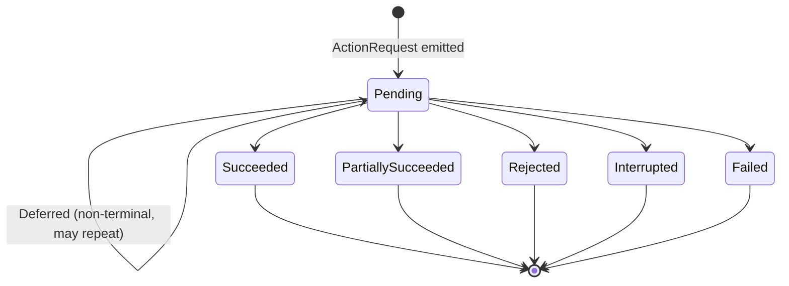

# Public API map

Namespace root is `TwoBrains.Core`. Contract types live in `TwoBrains.Core.Contract`,
configuration in `TwoBrains.Core.Config`, determinism in `TwoBrains.Core.Determinism`,
and the compatibility preset in `TwoBrains.Core.Compat`.

| Need | Type |
|---|---|
| Drive everything | `TwoBrainsSystem` (facade) |
| Per-tick input | `WorldSnapshot`, `MonsterSnapshot`, `TargetSnapshot`, `TickContext`, `Vec3` |
| Senses and memory | `Stimulus`, `SenseChannel`, `MemoryRecord` |
| Navigation and offstage | `NavCandidate`, `OffstageRegion`, `IngressPoint`, `ExclusionZone` |
| Script control | `ScriptDirective`, `ScriptDirectiveKind` |
| Per-tick output | `DecisionBatch`, `PressureDecision`, `ActionRequest`, `TelemetryEvent` |
| Host acknowledgement | `ActionResult`, `ActionStatus` |
| Save/load | `SavedStateEnvelope` |
| Macro without the facade | `PressureDirector`, `PressureState` |
| Micro without the facade | `MonsterAgent`, `MicroState` |
| Randomness | `DeterministicRng` |
| Configuration | `ProfileCatalogue`, `MonsterProfileConfig`, `EffectiveConfig`, `ConfigException` |
| Research preset | `AlienIsolationPresets`, `AlienIsolationConfigRecord` |

## TwoBrainsSystem

The single entry point. Owns both layers, both RNG forks, profile resolution, and the
per-tick phase order ([TICK_ORDER.md](TICK_ORDER.md)). All decisions flow through it.

| Member | Type | Meaning |
|---|---|---|
| `TwoBrainsSystem(catalogue, profileName, seed, modifierName = null)` | ctor | Resolves and validates the profile (with optional additive modifier), forks macro (stream 1) and micro (stream 2) RNGs from `seed`. |
| `Tick(snapshot)` | `DecisionBatch` | Runs one tick. Snapshots must arrive in order, exactly once per tick index; a gap or duplicate throws `InvalidOperationException`. |
| `CaptureState()` | `SavedStateEnvelope` | Complete deterministic state, schema version 1. |
| `RestoreState(envelope)` | `void` | Restores a captured state. Throws `ConfigException` on an unsupported schema version. |
| `SetProfile(profileName, modifierName = null)` | `void` | Hot-switches the active profile (validated at resolve time). |
| `Config` | `EffectiveConfig` | Final effective configuration currently in force. |
| `MacroState` | `PressureState` | Live macro state (read-only diagnostics view). |
| `MicroState` | `MicroState` | Live micro state (read-only diagnostics view). |
| `NextTickIndex` | `long` | Tick index the next `Tick` call must supply. |
| `SimTimeSeconds` | `double` | Accumulated simulated seconds. |
| `ActiveProfileName` | `string` | Active profile name, `name+modifier` when a modifier is applied. |

## Action acknowledgement lifecycle

Every `ActionRequest` gets a deterministic id (`a{tick}-{ordinal}`) and a future
`ExpiryTick`. The host executes it and reports back on a **later** tick via
`WorldSnapshot.Acknowledgements`:

- Exactly one terminal status (`Succeeded`, `PartiallySucceeded`, `Rejected`,
  `Interrupted`, `Failed`) may arrive per action id; `Deferred` may repeat first.
- A terminal ack clears the pending entry. Rejections and failures set cooldowns and
  flags that steer next-tick selection (pathfinding-failure recovery included).
- Unknown ids are ignored with telemetry (`ack_unknown`), never fatal.
- **Opportunities reuse the same channel.** An ack whose `ActionId` equals the
  macro's pending opportunity id (`PressureDecision.OpportunityId`, format
  `op{tick}-{count}`) is routed to the macro instead of the micro. For an
  opportunity, `Deferred` buys a single extension by the original interval.

## Contract — snapshots

### Vec3 (readonly struct)

Engine-independent 3D vector, double precision, metres.

| Member | Type | Units | Meaning |
|---|---|---|---|
| `X`, `Y`, `Z` | `double` | m | Components. |
| `Zero` | `Vec3` | m | `(0,0,0)`. |
| `+`, `-`, `*` (scalar) | operators | m | Component-wise arithmetic. |
| `LengthSquared()` / `Length()` | `double` | m² / m | Magnitude (uses `Math.Sqrt`). |
| `DistanceTo(other)` / `DistanceSquaredTo(other)` | `double` | m / m² | 3D distance. |
| `PlanarDistanceTo(other)` | `double` | m | Horizontal distance; vertical axis ignored. |

### TickContext (readonly struct)

Explicit monotonic time for one tick. Constructed by the facade from the snapshot;
hosts only supply the two fields via `WorldSnapshot`.

| Member | Type | Units | Meaning |
|---|---|---|---|
| `TickIndex` | `long` | ticks | 0-based, strictly increasing by 1. Must be ≥ 0. |
| `DeltaTimeSeconds` | `double` | s | Simulated step. Must be finite and in (0, 60]. |

### WorldSnapshot

The complete immutable input for one tick. Everything policy may know is in here;
engine queries during evaluation are forbidden by design.

| Member | Type | Units | Meaning |
|---|---|---|---|
| `TickIndex` | `long` | ticks | Must equal the facade's `NextTickIndex`. |
| `DeltaTimeSeconds` | `double` | s | Step since previous tick. Default `1/60`. |
| `Monster` | `MonsterSnapshot` | — | The controlled monster. Required. |
| `Targets` | `List<TargetSnapshot>` | — | All relevant participants (prey/threats). |
| `CurrentStimuli` | `List<Stimulus>` | — | Stimuli sensed this tick (current evidence). |
| `NavCandidates` | `List<NavCandidate>` | — | Navigation options with host facts. |
| `OffstageRegions` | `List<OffstageRegion>` | — | Approved offstage areas and topology. |
| `IngressPoints` | `List<IngressPoint>` | — | Approved stage-transition points. |
| `ExclusionZones` | `List<ExclusionZone>` | — | Active spatial exclusion zones. |
| `Directives` | `List<ScriptDirective>` | — | Script orders, consumed once this tick. |
| `Acknowledgements` | `List<ActionResult>` | — | Results for earlier requests/opportunities. |
| `OmniscientTargets` | `bool` | — | Grants perfect target knowledge. Default `false`; telemetry-visible when set. |

### MonsterSnapshot

Host view of the monster for one tick.

| Member | Type | Units | Meaning |
|---|---|---|---|
| `MonsterId` | `string` | — | Stable id. |
| `Position` | `Vec3` | m | Current position. |
| `RegionId` | `string` | — | Host region containing the monster. |
| `Lifecycle` | `MonsterLifecycle` | — | `Alive`, `Dead`, `Suspended`, `Despawning`. |
| `Presence` | `StagePresence` | — | `Frontstage`, `Offstage`, or `InIngress` (mid-traversal). |
| `HealthFraction` | `double` | [0,1] | 1 = undamaged. |
| `CurrentTargetId` | `string` | — | Host-observed current target, if any. |
| `RouteAvailable` | `bool` | — | Host navigation can route to the current goal now. |
| `ActiveActionId` | `string` | — | Action the host is still executing (unacknowledged). |
| `CurrentIngressId` | `string` | — | Ingress being traversed when `Presence` is `InIngress`. |
| `LastDamageTick` | `long` | ticks | Last damage tick; -1 = never. |
| `LastStunnedTick` | `long` | ticks | Last stun tick; -1 = never. |
| `CanMove`, `CanAttack`, `CanTraverseIngress`, `CanPlayScripted` | `bool` | — | Host feasibility facts (animation/combat/movement capability this tick). |
| `Flags` | `string[]` | — | Free-form host flags (e.g. "flamed", "aimed_at"); policy reads, never invents. |

### TargetSnapshot

Host view of one participant for one tick.

| Member | Type | Units | Meaning |
|---|---|---|---|
| `TargetId` | `string` | — | Stable id. |
| `IsValid`, `IsAlive` | `bool` | — | Existence/liveness gates (both default `true`). |
| `Position` | `Vec3` | m | Current position. |
| `RegionId` | `string` | — | Host region containing the target. |
| `IsVisible` | `bool` | — | Host LOS fact: the monster can see this target now. |
| `HealthFraction` | `double` | [0,1] | 1 = undamaged. |
| `IsArmed` | `bool` | — | Carries a weapon that can hurt the monster. |
| `IsAimingAtMonster` | `bool` | — | Currently aiming at the monster (threat input). |
| `IsUsingDeterrent` | `bool` | — | Exposed to a damage-over-time deterrent this tick. |
| `IsHiding` | `bool` | — | Concealed from normal senses. |
| `ThreatRating` | `double` | [0,1] | Host rating: 0 = harmless prey, 1 = lethal threat. |
| `ObjectiveId` | `string` | — | Objective being progressed, if any. |
| `ObjectiveProgress` | `double` | [0,1] | Drives exclusion/pressure eligibility. |
| `LightLevel` | `double` | [0,1] | Ambient light at the target (Light channel input). |
| `PressureEligible` | `bool` | — | Whether pressure may target this participant (default `true`). |

## Contract — stimuli and memory

### SenseChannel (enum)

`Visual = 0`, `Auditory = 1`, `Touch = 2`, `Damage = 3`, `Light = 4`,
`GameDefined = 5`. Game-specific senses use `GameDefined` plus `Stimulus.Subtype`.

### Stimulus

One host-reported sensed event on the current tick. Ids are host-assigned and must be
stable across ticks for the same logical stimulus (re-report to refresh it).

| Member | Type | Units | Meaning |
|---|---|---|---|
| `StimulusId` | `string` | — | Stable host id. |
| `Channel` | `SenseChannel` | — | Sensory channel. |
| `Subtype` | `string` | — | Optional game-defined subtype ("footstep", "gunshot", ...). |
| `Position` | `Vec3` | m | Observed position; may be imprecise for non-visual channels. |
| `RegionId` | `string` | — | Host region containing `Position`; empty if none. |
| `Confidence` | `double` | [0,1] | Host confidence the stimulus is real and located correctly. |
| `TargetId` | `string` | — | Attributed participant identity, if known. |
| `CreatedTick` | `long` | ticks | First reported tick. |
| `LastConfirmedTick` | `long` | ticks | Last confirmed tick (this tick when fresh). |

### MemoryRecord

A remembered stimulus owned by micro perception. Confidence decays per channel; the
record is dropped at zero or on expiry.

| Member | Type | Units | Meaning |
|---|---|---|---|
| `StimulusId` | `string` | — | Inherited from the originating stimulus. |
| `Channel` | `SenseChannel` | — | Channel it arrived on. |
| `Subtype` | `string` | — | Optional subtype carried over. |
| `Position` | `Vec3` | m | Remembered position; only refreshed by a fresh stimulus. |
| `RegionId` | `string` | — | Host region of the remembered position. |
| `BaseConfidence` | `double` | [0,1] | Confidence at last confirmation. |
| `DecayedConfidence` | `double` | [0,1] | Current confidence after deterministic decay. |
| `TargetId` | `string` | — | Attributed participant identity, if any. |
| `CreatedTick` | `long` | ticks | Creation tick. |
| `LastConfirmedTick` | `long` | ticks | Last refresh by a matching stimulus. |
| `ConfirmedThisTick` | `bool` | — | True while also present in current evidence. |

## Contract — navigation and offstage

### NavCandidate

One host-supplied navigation option. The core never queries a navmesh; all
reachability, distance, and visibility facts arrive in this record.

| Member | Type | Units | Meaning |
|---|---|---|---|
| `NodeId` | `string` | — | Stable node id. |
| `Kind` | `NavCandidateKind` | — | `FrontstageNode`, `OffstageNode`, `Ingress`. |
| `Position` | `Vec3` | m | Node position. |
| `RegionId` | `string` | — | Containing region. |
| `Reachable` | `bool` | — | A route from the monster exists now (default `true`). |
| `RouteDistance` | `double` | m | Host-computed route distance (not straight-line); < 0 = unknown. |
| `HasLineOfSight` | `bool` | — | Host LOS fact from the monster. |
| `IngressId` | `string` | — | For `Kind == Ingress`: matching `IngressPoint` id. |
| `ExtraCost` | `double` | — | Optional host cost bias; higher = less attractive, ≥ 0. |

### OffstageRegion

A non-visible area the monster can occupy for staging and sweeps. Membership is the
only spatial truth the core has about offstage space.

| Member | Type | Meaning |
|---|---|---|
| `RegionId` | `string` | Region id. |
| `NodeIds` | `List<string>` | `NavCandidate.NodeId`s inside this region. |
| `IngressIds` | `List<string>` | `IngressPoint.IngressId`s leading into this region. |
| `AdjacentRegionIds` | `List<string>` | Frontstage region ids this region is adjacent to (host topology). |

### IngressPoint

A host-approved transition point between frontstage and offstage. Offstage
repositioning happens only through these; every use is logged and acknowledged.

| Member | Type | Units | Meaning |
|---|---|---|---|
| `IngressId` | `string` | — | Stable id. |
| `Kind` | `IngressKind` | — | `Vent`, `Door`, `Tunnel`, `Custom`. |
| `Position` | `Vec3` | m | Traversal point position. |
| `RegionId` | `string` | — | Frontstage region this point serves. |
| `OffstageNodeId` | `string` | — | Offstage node (`NavCandidate.NodeId`) it connects to. |
| `Usable` | `bool` | — | Host feasibility fact: traversal possible right now. |
| `CooldownUntilTick` | `long` | ticks | Host-side cooldown; not usable again until this tick. -1 = none. |

### ExclusionZone

A spherical host-authored zone the macro must respect when choosing candidates and
staging — explicit world data instead of hidden rules.

| Member | Type | Units | Meaning |
|---|---|---|---|
| `ZoneId` | `string` | — | Stable id. |
| `Kind` | `ExclusionKind` | — | `Target`, `Objective`, `Custom`. |
| `Center` | `Vec3` | m | Zone center. |
| `Radius` | `double` | m | > 0 (default 10). |
| `Active` | `bool` | — | Inactive zones are ignored but kept for save/replay stability. |

## Contract — directives

### ScriptDirective

One host script order, consumed once on the tick it arrives and recorded in telemetry
as an explicit override. `SetProfile` is handled by the facade; mode/progression/
reset/opportunity directives go to the macro; withdrawal/sequence/despawn go to the
micro.

| Member | Type | Units | Meaning |
|---|---|---|---|
| `DirectiveId` | `string` | — | Stable id for host-side correlation. |
| `Kind` | `ScriptDirectiveKind` | — | See below. |
| `Mode` | `PressureMode` | — | `SetPressureMode`: desired mode. |
| `Progression` | `double` | [0,1] | `SetProgression`: new progression. `SetPressureMode`: optional new progression, applied only when > 0. |
| `ResetGauge` | `bool` | — | `SetPressureMode`: also reset pressure. `ResetPressure`: when true, restart Aggressive at progression 1.0; when false, restart Normal at `StartProgression`. |
| `ProfileName` | `string` | — | `SetProfile`: profile name (must exist in the catalogue). |
| `RegionId` | `string` | — | `ForceOpportunity`: preferred region (empty = director's choice). |
| `SequenceName` | `string` | — | `PlayScriptedSequence`: host-understood sequence name. |

`ScriptDirectiveKind`: `SetPressureMode = 0`, `SetProgression = 1`,
`ResetPressure = 2`, `SetProfile = 3`, `ForceOpportunity = 4`,
`ForceWithdrawal = 5`, `PlayScriptedSequence = 6`, `Despawn = 7`.

## Contract — decisions and actions

### PressureDecision

Declarative macro output: bias and constraints, never target coordinates or movement
instructions. Emitted only on change ticks; the host may acknowledge, reject, or
defer the opportunity.

| Member | Type | Units | Meaning |
|---|---|---|---|
| `OpportunityId` | `string` | — | Stable id for this opportunity (`op{tick}-{count}`). |
| `Mode` | `PressureMode` | — | `Normal` (accumulating) or `Aggressive` (discharging). |
| `Progression` | `double` | [0,1] | Current gauge progression. |
| `Urgency` | `double` | [0,1] | Derived from progression, mode, cooldowns. |
| `CandidateRegionId` | `string` | — | Candidate region for staging; empty when none. |
| `AllowedRoles` | `string[]` | — | Roles the micro may assume (e.g. "stalker", "ambusher", "sweeper"). |
| `IngressConstraints` | `string[]` | — | Suggested ingress ids (hints, not orders). |
| `ExclusionConstraints` | `string[]` | — | Exclusion zone ids that shaped this decision (diagnostics). |
| `ExpiryTick` | `long` | ticks | Tick after which the opportunity lapses. |
| `ReasonCode` | `string` | — | Machine-readable reason (telemetry key). |
| `Evidence` | `string[]` | — | Human-readable evidence lines (config values, checks). |

### ActionRequest

One declarative action for the host to execute and later acknowledge.

| Member | Type | Units | Meaning |
|---|---|---|---|
| `ActionId` | `string` | — | Deterministic id, `a{tick}-{ordinal}`. |
| `Kind` | `ActionKind` | — | `MoveTo`, `Search`, `Investigate`, `Stalk`, `Ambush`, `Threat`, `Chase`, `Attack`, `Retreat`, `UseIngress`, `Wait`, `Scripted`, `Custom`. |
| `Destination` | `Vec3?` | m | MoveTo/Chase/Retreat destination, when relevant. |
| `RegionId` | `string` | — | Region scope for Search/Stalk/Sweep-style actions. |
| `NodeId` | `string` | — | Specific nav node, when the module selected one. |
| `IngressId` | `string` | — | Ingress id for `UseIngress`. |
| `TargetId` | `string` | — | Participant id for Chase/Attack/Threat/Stalk. |
| `StimulusId` | `string` | — | Stimulus/memory id for `Investigate`. |
| `SpeedScale` | `double` | [0,1] | Desired speed scale (host maps to locomotion); default 1. |
| `Param` | `string` | — | Custom payload (sequence name, game-defined data). |
| `ExpiryTick` | `long` | ticks | Tick after which the request is lapsed. |
| `ReasonCode` | `string` | — | Machine-readable reason (module + gate) for diagnostics. |

### ActionResult

Host acknowledgement delivered on a later tick. See the lifecycle section above.

| Member | Type | Units | Meaning |
|---|---|---|---|
| `ActionId` | `string` | — | Id of the request (or opportunity) being acknowledged. |
| `Status` | `ActionStatus` | — | `Succeeded`, `PartiallySucceeded`, `Rejected`, `Deferred`, `Interrupted`, `Failed`. |
| `Detail` | `string` | — | Host explanation ("no route", "animation busy"); diagnostics only. |
| `ResultTick` | `long` | ticks | Tick the host produced this result. |

### DecisionBatch

Everything the policy decided on one tick. Pure data; the replay contract requires it
to serialize to byte-identical canonical JSON for identical inputs.

| Member | Type | Meaning |
|---|---|---|
| `TickIndex` | `long` | Tick this batch belongs to. |
| `Macro` | `PressureDecision` | Macro output this tick, or null when nothing changed. |
| `Actions` | `List<ActionRequest>` | Requests for the host to execute and acknowledge. |
| `Telemetry` | `List<TelemetryEvent>` | Structured diagnostics in deterministic emission order. |
| `StateHash` | `ulong` | FNV-1a 64-bit hash of full internal state after this tick. |

## Contract — telemetry

### TelemetryEvent

One structured diagnostics record. Every transition, override, exclusion decision,
and acknowledgement emits one.

| Member | Type | Meaning |
|---|---|---|
| `Tick` | `long` | Emission tick. |
| `Category` | `string` | Subsystem: "macro", "micro", "perception", "action", "config", "state". |
| `Code` | `string` | Machine-readable reason code (e.g. "aggressive_started", "nav_failed"). |
| `Message` | `string` | Human-readable detail line. |

Macro reason codes (stable): `candidate_latched`, `candidate_cleared`,
`mode_aggressive_start`, `opportunity_offered`, `opportunity_completed`,
`opportunity_expired`, `opportunity_rejected`, `quota_event`, `quota_blocked`,
`reset`, `script_set_mode`, `script_set_progression`, `script_forced_opportunity`,
`ack_unknown`. The facade adds `profile_switch` under category "config".

Micro reason codes (stable): `action_lapsed`, `ack_unknown`, `action_partial`,
`action_rejected`, `action_failed`, `action_interrupted`, `preempt`,
`action_infeasible` (category "action"); `omniscience_active` (category
"perception"); `lifecycle_inactive`, `nav_recovery`, `despawn_requested`,
`script_sequence`, `script_withdrawal`, `stagger`, `retreat_start`, `hesitate`,
`flank`, `threat_timeout`, `ambush_start`, `ambush_timeout`, `attack_commit`,
`chase`, `chase_lost`, `suspect_response`, `hiding_target`, `investigate_react`,
`investigate_approach`, `investigate_inspect`, `investigate_done`,
`investigate_reset`, `search`, `search_start`, `search_end`, `stalk`,
`ingress_use`, `sweep_move`, `sweep_dwell`, `sweep_end`, `idle`, `micro_reset`,
`module_unknown` (category "micro").

## Contract — saved state

### SavedStateEnvelope

Versioned, complete save payload. Restoring at tick *n* and replaying identical
inputs must produce byte-identical decisions.

| Member | Type | Units | Meaning |
|---|---|---|---|
| `SchemaVersion` | `int` | — | Serialization schema version; current = 1. |
| `ConfigVersion` | `string` | — | Config/profile version marker (from the resolved profile). |
| `TickIndex` | `long` | ticks | Tick this state was captured at; next tick to run is `TickIndex + 1`. |
| `SimTimeSeconds` | `double` | s | Accumulated simulated seconds. |
| `MacroRngS0`, `MacroRngS1` | `ulong` | — | Complete macro RNG state. |
| `MicroRngS0`, `MicroRngS1` | `ulong` | — | Complete micro RNG state. |
| `MacroStateJson` | `string` | — | Macro subsystem state blob (owned by `PressureDirector`). |
| `MicroStateJson` | `string` | — | Micro subsystem state blob (owned by `MonsterAgent`). |

## PressureDirector (advanced use without the facade)

`TwoBrains.Core.Macro.PressureDirector` — the macro layer standalone. Hosts driving
it directly must reproduce the facade's call order: `ApplyOpportunityResults`, then
`ApplyDirectives`, then `Tick`, once per tick, with timer aging inside `Tick`.

| Member | Signature | Meaning |
|---|---|---|
| ctor | `PressureDirector(DeterministicRng rng)` | Fresh state; `rng` must be a dedicated fork. |
| `State` | `PressureState` | Live state (mutated only inside the director). |
| `ApplyOpportunityResults` | `(ctx, cfg, results, telemetry)` | Host acks of the pending opportunity. |
| `ApplyDirectives` | `(ctx, cfg, directives, telemetry)` | `SetPressureMode`/`SetProgression`/`ResetPressure`/`ForceOpportunity`. |
| `Tick` | `(ctx, world, cfg, telemetry) → PressureDecision` | Ages timers, updates gauge, evaluates transitions; returns a decision only on change ticks, else null. |
| `ResetToStart` | `(ctx, cfg, startAggressive, telemetry)` | Full reset of counts/latches; starts a fresh cycle in the requested mode. |
| `CaptureState` | `() → string` | Canonical JSON of complete state (RNG words are saved by the caller). |
| `RestoreState` | `(string json)` | Restores a captured state. |

### PressureState

Complete serializable macro state. Timers are seconds remaining; counts are
non-negative.

| Member | Type | Units | Meaning |
|---|---|---|---|
| `Mode` | `PressureMode` | — | Current mode (default `Normal`). |
| `Progression` | `double` | [0,1] | Gauge progression. |
| `CompletedOpportunities` | `int` | count | Completed opportunities this session. |
| `EventQuotaProgress` | `int` | count | Progress toward the event quota. |
| `EventQuotaTarget` | `int` | count | Randomized quota target; 0 = disabled/exhausted. |
| `Enabled` | `bool` | — | Master enable (default `true`). |
| `CandidateLatched` | `bool` | — | A viable candidate region is held. |
| `CooldownRemaining` | `double` | s | Post-completion cooldown remaining. |
| `DecreaseDelayRemaining` | `double` | s | Decrease grace remaining. |
| `ActiveCandidateId` | `string` | — | Latched candidate region id; empty when none. |
| `PendingOpportunityId` | `string` | — | Outstanding opportunity id the host may still ack. |
| `OpportunityExpiryTick` | `long` | ticks | Tick the pending opportunity lapses. |
| `PendingDeferExtensionUsed` | `bool` | — | The pending opportunity consumed its single defer extension. |
| `LastTransitionTick` | `long` | ticks | Last mode transition; -1 = never. |
| `SweepSecondsRemaining` | `double` | s | Time left in the current sweep window. |
| `IngressAttractRemaining` | `double` | s | Ingress-attraction window remaining; 0 = closed. |
| `IngressBanRemaining` | `SortedDictionary<string, double>` | s | Per-ingress ban time remaining (ordinal-sorted). |
| `RecentReasons` | `List<string>` | — | Bounded recent reason codes (max `MaxRecentReasons` = 16). |

## MonsterAgent (advanced use without the facade)

`TwoBrains.Core.Micro.MonsterAgent` — the micro layer standalone. Call order per
tick: `ApplyActionResults`, then `ApplyDirectives`, then `Tick`.

| Member | Signature | Meaning |
|---|---|---|
| ctor | `MonsterAgent(DeterministicRng rng)` | Fresh state; `rng` must be a dedicated fork. |
| `State` | `MicroState` | Live state (mutated only inside the agent). |
| `ApplyActionResults` | `(ctx, cfg, results, telemetry)` | Host acks; failures feed timers/flags/recovery. |
| `ApplyDirectives` | `(ctx, cfg, directives, telemetry)` | `ForceWithdrawal`/`PlayScriptedSequence`/`Despawn`. |
| `Tick` | `(ctx, world, macro, cfg, telemetry) → List<ActionRequest>` | Ages memory/timers, arbitrates modules, emits requests. `macro` is this tick's bias and may be null. |
| `Reset` | `(ctx, cfg, telemetry)` | Resets runtime state (lifecycle reset). |
| `CaptureState` | `() → string` | Canonical JSON of complete state (RNG words saved by the caller). |
| `RestoreState` | `(string json)` | Restores a captured state. |

### MicroState

Complete serializable micro state. Sorted containers keep serialization canonical.

| Member | Type | Units | Meaning |
|---|---|---|---|
| `Memories` | `List<MemoryRecord>` | — | Remembered stimuli, capacity-bounded. |
| `Motivations` | `SortedSet<string>` | — | Active motivation flags (e.g. "attack", "stalk"). |
| `ActiveModule` | `string` | — | Active module name; empty between modules. |
| `AwaitingActionId` | `string` | — | Action id currently awaited from the host. |
| `PendingActions` | `SortedDictionary<string, long>` | ticks | Outstanding requests, action id → expiry tick. |
| `Timers` | `SortedDictionary<string, double>` | s | Named countdown timers. |
| `Gauges` | `SortedDictionary<string, double>` | [0,1] | Named gauges (unless documented otherwise). |
| `Counters` | `SortedDictionary<string, long>` | count | Named monotonic counters. |
| `CurrentTargetId` | `string` | — | Current pursuit target; empty when none. |
| `LastSensedTargetTick` | `long` | ticks | Last direct sensing of the current target; -1 = never. |
| `LastSensedTargetPosition` | `Vec3?` | m | Last sensed target position; null when unknown. |
| `LastSearchRegionId` | `string` | — | Region of the last systematic search. |
| `LastSearchTick` | `long` | ticks | Last search episode; -1 = never. |
| `ConsecutiveNavFailures` | `int` | count | Consecutive pathfinding failures (drives recovery escalation). |
| `LastNavFailureTick` | `long` | ticks | Last pathfinding failure; -1 = never. |
| `InvestigationStage` | `int` | — | Investigation stage-machine position (module-owned). |
| `InvestigationStimulusId` | `string` | — | Stimulus under investigation; empty when none. |
| `ActiveIngressId` | `string` | — | Ingress currently being traversed; empty when none. |
| `ActiveScriptedSequence` | `string` | — | Scripted sequence in progress; empty when none. |
| `Flags` | `SortedSet<string>` | — | Module-local scratch flags (module-prefixed names). |
| `PendingMeta` | `SortedDictionary<string, PendingActionMeta>` | — | Bookkeeping per outstanding request (kind, original timeout interval, key params). |
| `LastMacro` | `PressureDecision` | — | Last macro bias received, latched until its `ExpiryTick`; null when none is active. |

### PendingActionMeta

Serializable bookkeeping for one outstanding `ActionRequest`: its kind, the original
timeout interval (used to extend a `Deferred` action exactly once), and the key
identifying parameters (used for ingress bans, duplicate detection, and lapse
handling).

| Member | Type | Units | Meaning |
|---|---|---|---|
| `Kind` | `ActionKind` | — | Kind of the outstanding request. |
| `IntervalTicks` | `long` | ticks | Original expiry interval (`ExpiryTick` minus issuing tick). |
| `TargetId` | `string` | — | Target parameter, when any. |
| `NodeId` | `string` | — | Node parameter, when any. |
| `RegionId` | `string` | — | Region parameter, when any. |
| `IngressId` | `string` | — | Ingress parameter, when any. |
| `StimulusId` | `string` | — | Stimulus parameter, when any. |
| `Param` | `string` | — | Custom payload. |
| `Destination` | `Vec3?` | m | Destination, when any. |

## DeterministicRng

`TwoBrains.Core.Determinism.DeterministicRng` — seedable, fully serializable
xorshift128+ RNG. Two 64-bit words are the complete state. Never use `System.Random`
in policy-adjacent code.

| Member | Signature | Meaning |
|---|---|---|
| ctor | `DeterministicRng(ulong seed)` | Seeds via splitmix64 expansion. |
| `NextUInt64()` | `ulong` | Next unsigned 64-bit value. |
| `NextDouble()` | `double` | Uniform in [0, 1) using the top 53 bits. |
| `NextRange(min, max)` | `double` | Uniform in [min, max); `max <= min` returns `min`. |
| `NextInt(maxExclusive)` | `int` | Uniform in [0, maxExclusive). |
| `NextInt(minInclusive, maxExclusive)` | `int` | Uniform in [min, maxExclusive). |
| `NextChance(probability)` | `bool` | True with the given probability (clamped to [0,1]). |
| `GetState()` | `(ulong S0, ulong S1)` | Complete state; enough to resume exactly. |
| `SetState(s0, s1)` | `void` | Restores a state from `GetState`. |
| `Fork(masterSeed, streamId)` | static `DeterministicRng` | Independent derived stream (the facade uses stream 1 for macro, 2 for micro). |

## Configuration types

Full field-by-field documentation is in [CONFIG_REFERENCE.md](CONFIG_REFERENCE.md);
this is the API surface only.

| Type | Purpose |
|---|---|
| `ProfileCatalogue` | Named profile store. `Add(profile)` (fluent), `Contains(name)`, `Names()` (ordinal-sorted), `Resolve(name) → EffectiveConfig`, `ResolveWithModifier(baseName, modifierName) → EffectiveConfig`. Resolution is deterministic, root-first, child wins; cycles and missing parents throw `ConfigException`. |
| `MonsterProfileConfig` | Inheritable profile: `Name`, `BasedOn`, `ConfigVersion`, and nullable sections `Pressure`, `Perception`, `Search`, `Threat`, `Combat`, `Offstage`, `Modules`, `Movement`. Null = inherit. |
| `EffectiveConfig` | Fully resolved, validated configuration — the only shape policy reads. `Validate()` returns error lines, `Validated()` throws on any violation, `Describe()` gives sorted `key=value` lines, `ComputeHash()` a stable FNV-1a identity for save/replay. |
| `ConfigException` | Thrown on validation or inheritance-resolution failure. |

## Compat: the research preset

`TwoBrains.Core.Compat` is the only namespace where game-specific names and recovered
constants appear. See [CONFIG_REFERENCE.md](CONFIG_REFERENCE.md#the-alienisolationinspired-preset)
for values and [EVIDENCE.md](EVIDENCE.md) for confidence labels.

| Type | Purpose |
|---|---|
| `AlienIsolationPresets` | Static preset data. `All()` returns the verbatim records in stable order; `ToProfile(record)` maps one to a `MonsterProfileConfig`; `CreateCatalogue()` builds a ready `ProfileCatalogue` with one profile per record plus the headliner `InspiredProfileName` ("ALIENISOLATIONINSPIRED", based on DEFAULT). |
| `AlienIsolationConfigRecord` | One verbatim decoded intensity configuration (nullable fields mirror the shipped data; shipped spelling preserved, including "MeanceDeemedTime"). `ToPressureSection()` maps it onto a generic `PressureSection`; engine `-1` sentinels map to 0 (disabled). Unmapped fields stay available on the record. |

See also: [architecture](ARCHITECTURE.md) · [configuration reference](CONFIG_REFERENCE.md) · [getting started](GETTING_STARTED.md) · [tuning](TUNING.md) · [evidence](EVIDENCE.md) · [tick order](TICK_ORDER.md)
