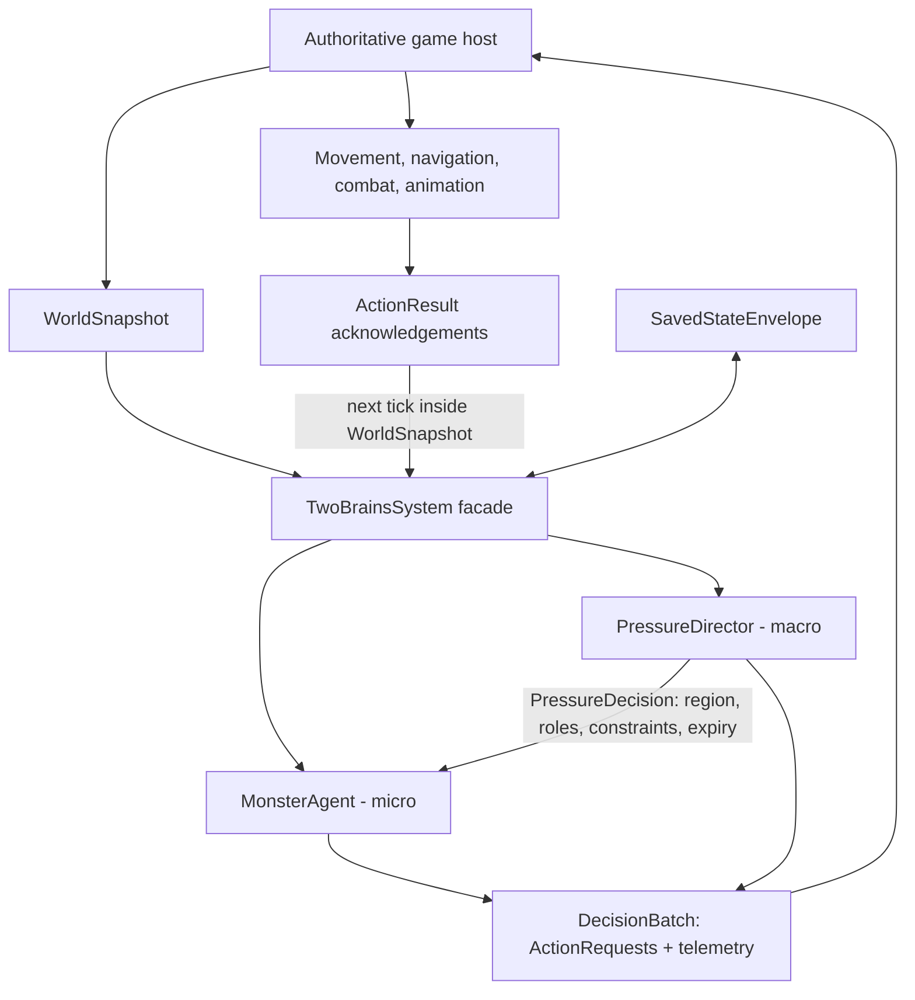
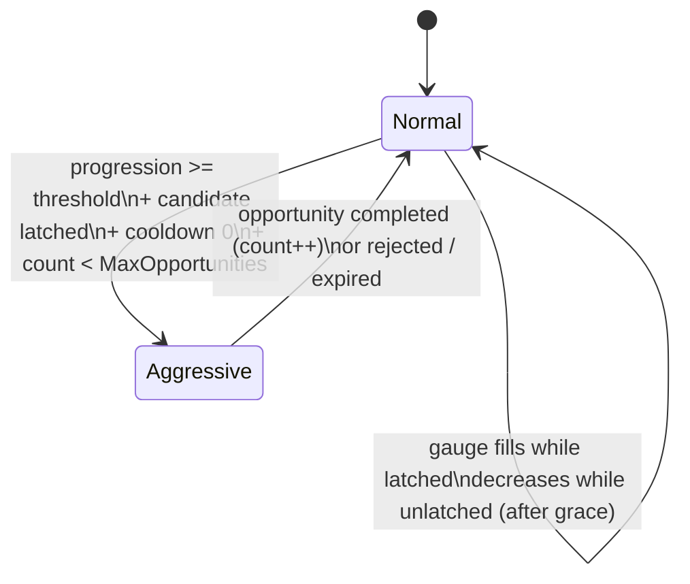

# Architecture

Two-Brain Director is a deterministic decision engine for a single monster. It never
searches scenes, moves entities, queries a navmesh, or owns game rules. The host
translates game state into an immutable `WorldSnapshot` per tick and executes the
declarative `DecisionBatch` that comes back. The "two brains" are a macro pacing
controller and a micro behavior agent, driven together by the `TwoBrainsSystem` facade.

## The responsibility boundary

The boundary is the design. It exists so the creature never behaves as if it knows
more than it should, and so the director can shape pacing without puppeteering.

- The **macro** layer (`PressureDirector`) decides *when and roughly where* tension
  should happen. Its output, `PressureDecision`, carries a candidate **region id**,
  allowed **roles**, ingress/exclusion **constraints**, and an **expiry tick**. It
  contains no target coordinates and no movement instructions — the contract type has
  no field that could hold them.
- The **micro** layer (`MonsterAgent`) decides *what the creature actually does* from
  its own perception memory and host-supplied navigation facts. It emits
  `ActionRequest`s (MoveTo, Search, Investigate, Stalk, Ambush, Threat, Chase,
  Attack, Retreat, UseIngress, Wait, Scripted, Custom) for the host to execute.
- Neither layer moves an entity. The host owns the world; the core owns only decisions.
- The host may reject, defer, or interrupt any request or opportunity; those
  acknowledgements feed back on a later tick and steer subsequent selection.

## Macro: PressureDirector

The macro is a pressure gauge with a two-state mode machine. It answers "should the
monster be menacing someone right now, and from which region?"

- **Gauge.** While a candidate region is latched and the mode is Normal, progression
  fills by `(1 - p) / max(FillSeconds, 0.5) * dt` — fast at first, asymptotic toward
  the threshold. When the latch is lost, a grace period (`DecreaseDelaySeconds`)
  runs first, then progression falls by `dt / DecreaseSeconds`.
- **Modes.** `Normal` accumulates; `Aggressive` discharges one opportunity. Entering
  Aggressive arms a sweep window (`SweepDurationSeconds`) and offers the opportunity
  to the host with an expiry tick. Completion — by sweep end or a successful host
  acknowledgement — increments the completed count, returns to Normal, resets the
  gauge to `StartProgression`, and starts `CooldownSeconds`.
- **Quotas.** `MaxOpportunities` caps completed opportunities; when it is reached,
  further transitions are blocked (`quota_blocked`). An optional event quota
  (`EventQuotaMin`/`EventQuotaMax`) rolls a seeded random target; reaching it emits a
  `quota_event` and resets the counters.
- **Candidates and exclusion.** A candidate is the region of the best viable target
  (valid, alive, pressure-eligible). Active host `ExclusionZone`s suppress targets
  within `Radius + margin`, where the margin is `ExclusionFirstMin` before the first
  completion and `ExclusionSubsequentMin` afterwards. Selection is deterministic:
  non-excluded first, then nearest planar distance, then ordinal id. A latched
  candidate is kept while any viable target remains in it (hysteresis).
- **Sweep and ingress.** Aggressive mode runs a bounded sweep window and suggests
  host-approved ingress points leading toward the candidate region (directly or via
  offstage adjacency), skipping unusable, cooling-down, or banned points. Latching a
  candidate opens an ingress-attraction window rolled from
  `IngressAttractMinSeconds..IngressAttractMaxSeconds`.
- **Script overrides.** `SetPressureMode`, `SetProgression`, `ResetPressure`, and
  `ForceOpportunity` directives apply before the update and are recorded in telemetry
  as explicit overrides. A decision is emitted only on ticks where something changed;
  all other ticks return `null` for the macro half of the batch.

## Micro: MonsterAgent

The micro is an ordered list of guarded modules over a perception-and-memory model.
It answers "given what I sense and remember, what do I do this tick?"

- **Perception.** Stimuli arrive on typed channels (Visual, Auditory, Touch, Damage,
  Light, GameDefined) with a host confidence. A stimulus activates when confidence
  meets the channel threshold; activation latches into memory.
- **Memory.** Each `MemoryRecord` decays deterministically by its channel half-life
  and is forgotten after `MaxAgeSeconds` or when capacity evicts it. Current evidence
  (this tick) and remembered evidence stay separate views; same-subject memories
  combine by `Max` or clamped `WeightedSum` per profile. There is no omniscient
  target location unless the host sets `WorldSnapshot.OmniscientTargets`, which is
  always telemetry-visible.
- **Motivations.** Named flags (e.g. attack, stalk, search) set by macro bias and
  local conditions gate the modules below.

Modules run in arbitration order; each returns Ineligible, Running, Succeeded,
Failed, or an action request, and the first non-Ineligible module wins the tick:

| # | Module | Role |
|---|---|---|
| 1 | Lifecycle | Death, suspension, reset, and pathfinding-failure recovery; always first. |
| 2 | ScriptOverride | Host/cinematic directives (scripted sequences, forced withdrawal, despawn). |
| 3 | DamageStun | Stun gauge response to accumulated damage. |
| 4 | Retreat | Retreat-gauge withdrawal, possibly toward offstage. |
| 5 | ThreatResponse | Threat-aware hesitation/flank/withdraw against dangerous targets. |
| 6 | Ambush | Hold concealed, waiting for opportunity. |
| 7 | Attack | Precondition gates, then chase / attack / ingress flank. |
| 8 | SuspectResponse | Reaction to suspicious stimuli. |
| 9 | HidingTarget | Handling of targets concealed from normal senses. |
| 10 | Investigate | Staged: react, approach, inspect, search. |
| 11 | Search | Systematic region search from memory and history, never exact coordinates. |
| 12 | Stalk | Frontstage shadowing at range, macro-biased. |
| 13 | Offstage | Sweep, ingress traversal, and offstage staging, macro-biased. |
| 14 | Idle | Bounded fallback when nothing else is eligible. |

Module order and enablement are per-profile config (`Modules.Order`,
`Modules.Disabled`). Every action checks host-reported feasibility — reachability,
route distance, target state, cooldowns, flags, animation/combat capability — and
rejected or failed requests set timers and flags that steer the next tick's choice.

## Determinism rules

Identical configuration, seed, tick sequence, snapshots, and acknowledgements produce
byte-identical decisions. The rules that make this hold:

- **Explicit monotonic time.** The host supplies `TickIndex` and `DeltaTimeSeconds`
  per tick; the facade accumulates `SimTimeSeconds`. Nothing reads a wall clock.
- **Seeded RNG forks.** All randomness flows through `DeterministicRng`
  (xorshift128+). The facade forks two streams from the master seed — macro stream 1,
  micro stream 2 — and both state words serialize into every save.
- **Restricted math.** Double precision with `+ − * /` and `Math.Sqrt` only. No
  transcendental functions anywhere in the core.
- **Sorted containers.** State dictionaries and sets are ordinal-sorted so canonical
  JSON — and therefore the per-tick `StateHash` — is byte-stable.
- **No ambient state.** No `System.Random`, no static mutable state, no engine
  singletons. Snapshots are consumed read-only.

## Save and replay contract

`CaptureState()` returns a versioned `SavedStateEnvelope` (schema 1): tick index, sim
time, all four RNG words, and the canonical-JSON state blobs of both subsystems.
`RestoreState()` puts every piece back. The contract:

- Restore at tick *n*, then feed identical subsequent inputs, and output is
  byte-identical to the uninterrupted run.
- Each `DecisionBatch` carries an FNV-1a `StateHash` over both subsystem states, both
  RNG streams, tick, and sim time; two runs with identical inputs must agree on it
  every tick.
- The envelope records `ConfigVersion`; the effective config hash
  (`EffectiveConfig.ComputeHash()`) gives profiles a stable identity. Restoring into
  a system built with a different profile or seed breaks the contract silently —
  check identity yourself.

The facade's exact phase order (validate, acknowledgements, directives, macro, micro,
conflict resolution, commit) is specified in [TICK_ORDER.md](TICK_ORDER.md).

See also: [API map](API.md) · [configuration reference](CONFIG_REFERENCE.md) · [getting started](GETTING_STARTED.md) · [tuning](TUNING.md) · [evidence](EVIDENCE.md) · [tick order](TICK_ORDER.md)
